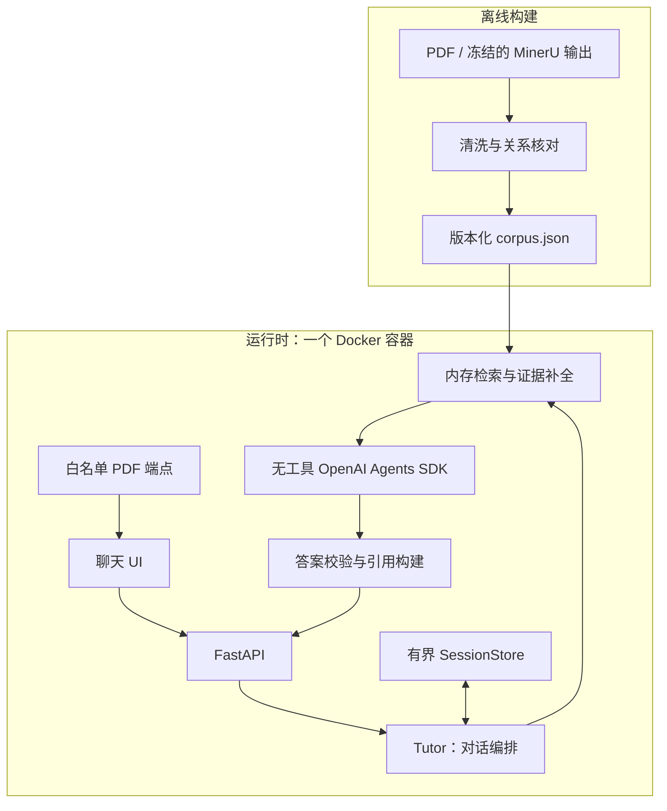

# InsureTutor 技术架构

状态：2026-09-30，离线清洗已实现，运行时仍为设计方案。
需求见 [任务说明](task-spec.md)；数据契约、原文差异、实现细节与验证待办见
[实现备忘](implementation-notes.zh-CN.md)。

## 总体结构

单容器、单 FastAPI/Uvicorn 进程，提供聊天 UI、对话 API 和原始 PDF。
检索索引与会话保存在进程内；离线生成并提交语料产物，容器启动时只加载与建索引。

## 技术栈与模块边界

| 模块 | 技术与接口 | 职责 |
| --- | --- | --- |
| 离线构建 | Python；清洗产物 → `data/corpus.json` | 生成检索单元、来源锚点与必需证据关系 |
| Retrieval | `rank-bm25`、OpenCC；`retrieve(query_context) → EvidenceBundle` | 三语规范化、排名、去重、补全脚注与例外 |
| Tutor | 应用代码；`answer(ChatTurn) → ChatResult` | 范围判定、会话、查询解析、生成与降级 |
| Generation | OpenAI Agents SDK；`generate(AnswerInput) → DraftAnswer` | `Agent(tools=[])`，结构化输入与输出，限定超时与重试 |
| Guardrails | Pydantic 与应用校验 | 校验来源、引用、冲突与回答边界 |
| HTTP / UI | FastAPI、静态聊天页面 | 请求传输、语言选择、答案与引用展示 |
| SessionStore | 有界内存存储 | 随机会话 ID、TTL、轮次上限、同会话请求串行化 |

Tutor 控制完整请求生命周期。检索由应用调用，结果传入 Generation；模型不决定检索、
不执行工具。当前规模不引入 RAG 框架、向量数据库或独立检索服务。

## 对话请求流程

1. 校验问题、语言与会话；处理越界请求及个性化购买建议边界。
2. 结合有限历史解析指代。独立问题直接检索；含糊追问最多改写一次，仍不明确则澄清。
3. 检索候选，补全强制脚注、例外及冲突双方，按完整证据组控制上下文预算。
4. 证据不足时返回 `insufficient_evidence`；否则组装本轮结构化证据并生成草稿。
5. 校验草稿，服务端生成原文摘录、物理页码与 PDF 链接，返回最终结果并更新会话。

普通问题一次生成调用；追问按需增加一次查询改写。最多一次格式修复。
模型未配置、超时或草稿校验失败时，返回明确标注的原文摘录。

## 三语检索与结构化注入

- 以条款、表格行、编号脚注为检索单元；命中主体后沿显式关系补全限定证据。
- 查询与索引使用相同规范化：OpenCC 繁转简、中文字符二元组、英文单词及数字／货币。
  双语术语别名连接中英文查询；别名只用于检索，原文用于引用。
- 中英文检索视图关联到同一主题证据组，各自保留来源锚点。按组去重，冲突时保留双方。
- 默认词法检索。三语评测证明释义召回不足时才增加多语言向量，并以 RRF 融合排名。
- 固定策略放在应用指令中；问题、有限历史与 `EvidenceBundle` 作为序列化数据输入。
- 模型只输出状态与 `claims[{text, evidence_ids}]`。引用文本、页码和 URL 由服务端构建。

## 安全边界

| 边界 | 约束 |
| --- | --- |
| 输入 | 服务端持有消息角色与历史；限定长度、轮次与来源，不接受客户端自定义系统指令 |
| 模型上下文 | 用户问题、历史和检索文本均视为不可信数据；每轮重新检索，历史回答不作为事实证据 |
| 模型权限 | 无工具、无上传或任意 URL 抓取能力；密钥不进入上下文或浏览器 |
| 回答 | 只解释文档；拒绝个人购买决策，证据不足不补猜，已知冲突不能被模型覆盖 |
| 输出 | 引用 ID 必须属于本轮证据，强制限定证据必须完整；检查数字与货币，拒绝模型来源 URL |
| 展示 | 安全渲染文本；校验完成后返回答案，不直接流式展示模型 token |

结构化输出与确定性校验约束格式、溯源及部分事实条件，不能保证语义正确或彻底防止
提示词注入；答案质量和边界行为通过针对性评测验证。

## API、UI 与部署

| 接口 | 输入 / 输出 |
| --- | --- |
| `POST /api/chat` | 问题、可选会话 ID、`auto / en / zh-Hans / zh-Hant`；返回状态、claims、服务端引用 |
| `GET /api/health` | 语料就绪状态、作答模式 |
| `GET /sources/{source_id}.pdf` | 白名单源 PDF；引用链接使用 `#page=N` 的物理页锚点 |

UI 展示聊天、语言选择、请求等待状态、原文摘录和页码链接；冲突与摘录模式明确标识。
回答遵循请求语言，引用保留来源语言。

Docker 包含锁定依赖、代码、静态 UI、语料与 PDF；启动校验语料格式、哈希及关系完整性。
运行时不解析 PDF、不下载模型。一个 worker，重启清空会话；密钥通过环境变量传入。
日志记录请求 ID、阶段耗时、证据 ID 与降级原因。
