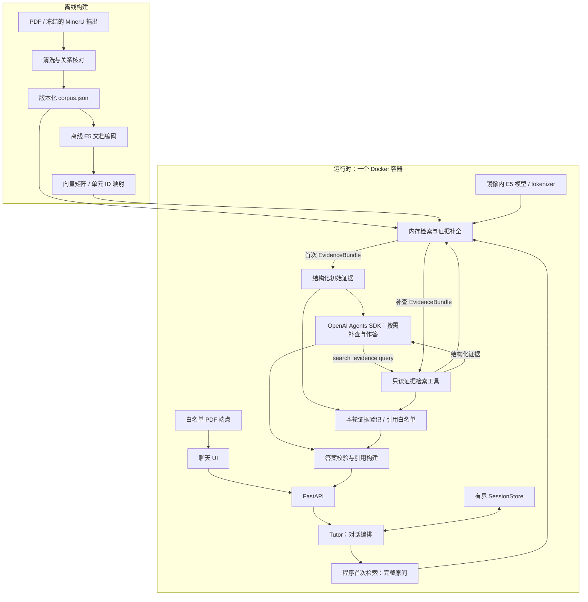

# InsureTutor 技术架构

状态：2026-10-01，离线清洗、语料构建、本地混合检索、首轮检索入口与只读补查工具已实现，agent 对话循环待实现。
需求见 [任务说明](task-spec.md)；数据契约、原文差异、实现细节与验证待办见
[实现备忘](implementation-notes.zh-CN.md)。

## 总体结构

单容器、单 FastAPI/Uvicorn 进程，提供聊天 UI、对话 API 和原始 PDF。
检索索引与会话保存在进程内；语料与文档向量离线生成，容器启动时加载产物并构建词法索引。



## 技术栈与模块边界

| 模块 | 技术与接口 | 职责 |
| --- | --- | --- |
| 离线构建 | Python；清洗产物 → corpus、向量矩阵及 ID 映射 | 生成检索单元、来源锚点、必需关系与文档向量 |
| Retrieval | `Retriever` 接口；NumPy、`rank-bm25`、OpenCC、FastEmbed | 三语规范化、混合排名、去重、补全脚注与例外 |
| Tutor | 应用代码；`answer(ChatTurn) → ChatResult` | 范围判定、会话、保证首次检索、有界 agent 运行、校验与降级 |
| Agent | OpenAI Agents SDK；`generate(AnswerInput) → DraftAnswer` | 读取初始证据，按需调用 `search_evidence` 补查，综合并输出结构化草稿 |
| Search tool | `search_evidence(query)` → 结构化证据 | 调用 Retriever，限制调用次数／预算，登记本轮可引用来源 |
| Guardrails | Pydantic 与应用校验 | 校验来源、引用、冲突与回答边界 |
| HTTP / UI | FastAPI、静态聊天页面 | 请求传输、语言选择、答案与引用展示 |
| SessionStore | 有界内存存储 | 随机会话 ID、TTL、轮次上限、同会话请求串行化 |

Tutor 控制请求生命周期和权限，先用完整原问检索一次，再将证据提供给 agent。
Agent 核对证据后决定直接作答或补查；SDK 负责有界循环，应用实现只读工具及最终校验。
当前规模不引入 RAG 框架、向量数据库或独立检索服务。

### 检索接口

```python
class Retriever(Protocol):
    async def retrieve(self, context: QueryContext) -> EvidenceBundle: ...
```

`QueryContext` 包含原始问题、可选改写查询与响应语言；`EvidenceBundle` 包含完整证据单元、
来源锚点、必需关系及冲突／质量标记。Tutor 只依赖该接口，具体实现在应用启动时注入。
NumPy 搜索、BM25、融合和证据补全封装在实现内部；未来替换 FAISS 或其他检索后端，
保持输入／输出契约即可，不改 Tutor 的调用流程。

## 对话请求流程

1. 校验问题、语言与会话；处理越界请求及个性化购买建议边界。
2. 为本轮创建检索状态与证据登记表，以完整原问执行一次检索，不拆题、不预先改写。
3. 将原问、有限历史及结构化初始证据提供给 agent；证据充分则直接作答，缺项时调用
   `search_evidence` 聚焦补查，核对条件与冲突，意图不明则澄清。
4. Agent 输出结构化草稿；服务端检查引用均来自本轮首次检索或补查结果，并校验冲突与回答边界。
5. 服务端生成原文摘录、物理页码与 PDF 链接，返回结果并更新有限历史。

每轮最多 6 次检索（程序首次 1 次＋agent 补查最多 5 次）、8 个 SDK 运行回合，设总超时；
首次检索不占 SDK 回合，检索次数由同一个执行器强制限制。
单次检索最多 8 个直接命中，本轮已返回来源按 ID 去重后合计不超过 12,000 字符。
首次与补查共用来源预算和引用白名单。超预算的新结果整组拒绝；agent 获得明确的限额反馈，
已返回证据保持完整。首次无结果时明确提供该状态，agent 可补查或说明证据不足。
达到限额仍缺证据则说明不足，不凭模型记忆补齐。模型未配置、工具调用不受支持、
超时或草稿校验失败时，降级为明确标注的可用原文摘录。最多一次格式修复。

首次与补查结果由 agent 核对与综合。应用登记返回证据和引用白名单，
不拆题、不跨查询融合排名、不让 agent 决定脚注是否保留。

## 本地 embedding 与混合召回

- 模型采用 `intfloat/multilingual-e5-small`：384 维、最长 512 token，中英文共用向量空间。
  FastEmbed 封装 ONNX Runtime，在 CPU 推理，无需 PyTorch 或外部 embedding API。
- 问题使用 `query: ` 前缀，文档使用 `passage: ` 前缀；采用带 attention mask 的均值池化，
  文档与查询向量均做 L2 归一化。
- 文档向量提前计算。运行时只编码新问题，NumPy 矩阵乘法全量计算余弦相似度。
  目前仅百余个逻辑单元，即使展开为数百条检索视图，矩阵仍很小；FAISS 的精确扫描不会
  改善召回语义或脚注补全，因此首版采用已有 NumPy，减少额外依赖与部署配置。
- BM25 与向量双路召回，以 RRF 融合排名。每一路先归并到逻辑单元，同一单元的中英文
  视图、子块及原问／改写取最高得分，各取 12 个单元，以等权 RRF（常数 60）融合。
  最多选中 8 个直接命中单元；分数不作为作答置信概率，响应语言不限制检索来源。
- 查询与检索文本统一规范化。中文使用 OpenCC 繁转简；BM25 保留中文字符二元组、英文
  单词、数字与货币。经核对的双语术语别名只用于检索，不作为可引用原文。

模型与 tokenizer 在镜像构建时按固定版本准备，运行时仅从本地加载。FP32 ONNX 作为
基线，固定 FastEmbed 0.8.1、ONNX Runtime 1.24.2，与语料 tokenizer 使用相同模型 revision；
INT8 通过目标 CPU 性能和三语召回验证后替换，并使用同一模型产物重算文档向量。
记录语料、模型、tokenizer、规范化和编码配置版本，启动时校验向量与当前配置匹配。

## 分块与证据补全

| 层次 | 边界与用途 |
| --- | --- |
| 原子证据单元 | 完整条款、携带表头／单位的逻辑表格行、完整脚注、风险或免责声明 |
| 检索视图／子块 | 中英文分别编码；长单元按完整句子或子条件拆分，命中后恢复完整单元 |
| 证据关系 | `parent_unit_id` 恢复父单元；`requires` 补齐限定证据；双语对应与冲突关系保留各自来源 |

沿用清洗产物的结构与显式关系。检索文本携带已核对的标题、所属权益和表头；按模型
tokenizer 测长，确保标题、前缀与正文一起满足长度限制，避免自动截断限定条件。

清洗阶段就把来源及完整正文按语言拆开。每个逻辑单元保存两条独立中英记录，通过
`pair_id/parallel_id` 严格对应；父单元只保存关系，不含混排正文。来源片段只标
`zh-Hant/en`，分别保留页码与来源范围。具体字段见实现备忘。
检索视图连接到同一逻辑单元；简体仅为检索文本。英文不含中文，长内容可按各语言的 token 长度分别拆分。
同主题不等于原文一致，语言配对状态与冲突标记必须传递到回答层。

命中后恢复完整单元，递归补全必需脚注、例外与风险说明，再加入双语来源并对源片段去重。
已知冲突强制保留双方。脚注允许独立参与排名；正文命中时沿 `requires` 强制补齐全部规定
脚注，自动补入的单元不占 top-k，已有证据不重复加入。不按页面邻近猜测脚注归属。
去重后的完整来源文本预算为 12,000 字符；按排名加入完整证据组，超限则跳过整组。

借鉴 [LlamaIndex 节点引用](https://developers.llamaindex.ai/python/framework/integrations/retrievers/recursive_retriever_nodes/)
的小块召回／父块恢复，以及 [Contextual Retrieval](https://www.anthropic.com/engineering/contextual-retrieval)
的上下文前缀思路。跨页脚注与双语连接由显式关系处理，不依赖父子块命中比例自动合并。

## 结构化注入

- 固定策略放在应用指令中；原问、有限历史与结构化初始证据作为输入，补查证据作为工具结果。
- 两种证据使用同一结构：单元 ID、完整原文、必需关系、物理页码、bbox、冲突／质量标记；不重复传入清洗中间文本。
- 最终草稿只包含状态与 `claims[{text, evidence_ids}]`。引用文本、页码和 URL 由服务端构建。
- SDK 工具仅接受查询字符串；来源、索引、top-k、预算与引用登记由服务端控制。

## 安全边界

| 边界 | 约束 |
| --- | --- |
| 输入 | 服务端持有消息角色与历史；限定长度、轮次与来源，不接受客户端自定义系统指令 |
| 模型上下文 | 用户问题、历史和检索文本均视为不可信数据；每轮创建新的证据登记表，历史回答不作为事实证据 |
| 模型权限 | 仅可查询固定 corpus 的只读工具；无上传、任意文件／URL、代码执行或写入能力；密钥不进入上下文或浏览器 |
| 回答 | 只解释文档；拒绝个人购买决策，证据不足不补猜，已知冲突不能被模型覆盖 |
| 输出 | 引用 ID 必须属于本轮首次或补查提供的证据，强制限定证据必须完整；检查数字与货币，拒绝模型来源 URL |
| 展示 | 安全渲染文本；校验完成后返回答案，不直接流式展示模型 token |

结构化输出与确定性校验约束格式、溯源及部分事实条件，不能保证语义正确或彻底防止
提示词注入；答案质量和边界行为通过针对性评测验证。

## API、UI 与部署

| 接口 | 输入 / 输出 |
| --- | --- |
| `POST /api/chat` | 问题、可选会话 ID、`auto / en / zh-Hans / zh-Hant`；返回状态、claims、服务端引用 |
| `GET /api/health` | 语料就绪状态、作答模式 |
| `GET /sources/{source_id}.pdf` | 白名单源 PDF；引用链接使用 `#page=N` 的物理页锚点 |

UI 展示聊天、语言选择、请求等待状态、原文摘录和页码链接；冲突与摘录模式明确标识。
回答遵循请求语言，引用保留来源语言。

Docker 包含锁定依赖、代码、静态 UI、语料、向量、embedding 模型与 tokenizer、源 PDF；
启动校验语料格式、哈希、关系完整性与向量配置。
运行时不解析 PDF、不下载模型。一个 worker，重启清空会话；密钥通过环境变量传入。
日志记录请求 ID、阶段耗时、证据 ID 与降级原因。
