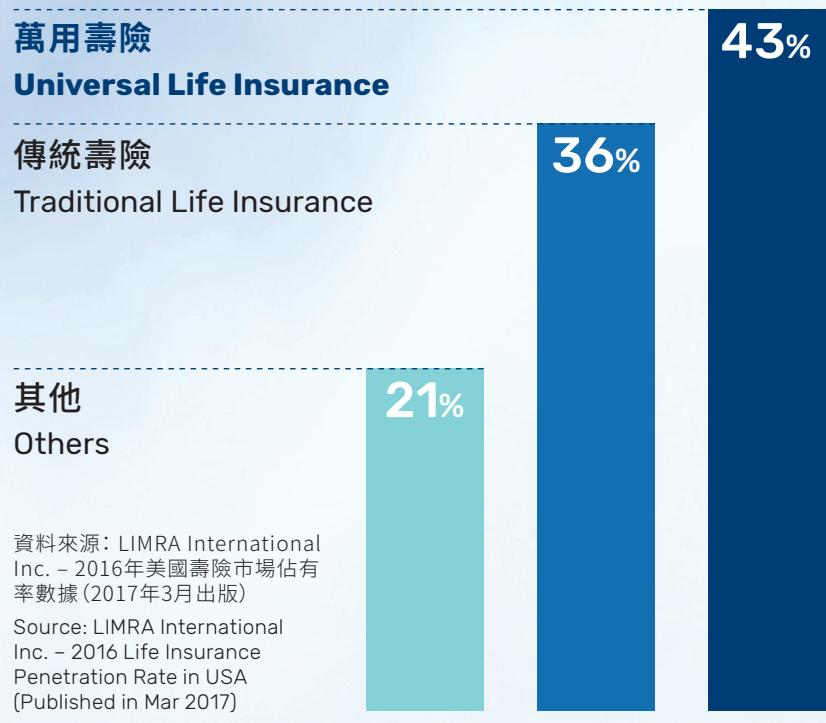
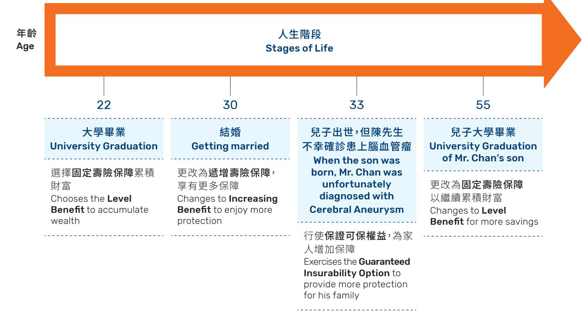
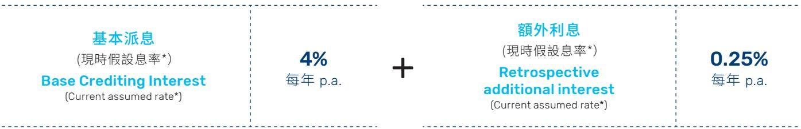

# 首選靈活萬用壽險計劃FLEXI-ULife Prime Saver

FP

YFLife 萬通保險

您可創造更豐厚的財富，盡享更精彩人生，只要您及早作出妥善的理財規劃。一份兼具靈活彈性和回報增長的萬用壽險計劃，正是伴您一生的最佳保障及理財方案。

With proper financial planning, you can achieve better wealth creation and enjoy a brighter future. A universal life insurance plan combining high flexibility and value growth is the best solution for your life protection and wealth management.

靈活方案 配合您一生的需要 Flexible solutions to cater for your lifelong needs

子女成才教育基金Education Funds

家人的生活保障Protection for Family

財富增值 Wealth Appreciation

萬用壽險在成熟市場已超越傳統壽險，成為客戶的壽險首選。

Universal Life has taken over Traditional Life to become the preferred option in developed markets.

妥善的財產分配 Wealth Preservation & Distribution

## 萬用壽險Universal Life Insurance

傳統壽險Traditional Life Insurance

## 其他Others

資料來源：LIMRA InternationalInc. – 2016年美國壽險市場佔有率數據（2017年3月出版）Source: LIMRA InternationalInc. – 2016 Life InsurancePenetration Rate in USA(Published in Mar 2017)

萬用壽險 — 真正為客戶度身訂造的保險計劃

Universal Life Insurance – a tailor-made insurance plan

靈活增減保障額 可於原有保單內增加保障額，無須另購新保單，省卻額外保單Flexible 費用。

Coverage Simply adjust the original Policy to increase the sum insured. No need to apply for a new Policy, thus saving additional policy charges.

優惠保費率 加保時仍按最初投保時年齡計算保費率。

Preferential The premium rate for new coverage will be based on the insured's Premium Rates age when the Policy was first issued instead of current age.

繳款彈性 如保單已累積現金價值，便可暫停繳交保費，而無須支付貸款Premium 利息。

Flexibility Allows you to skip payments if the Policy has accumulated a cash value, without any loan interest.

每月派息複式計算

Monthly interest at a compound rate

靈活提取現金 繼續享有保障，無須減低保障額。

Flexible cash Still enjoy protection without the need to reduce the sum insured. withdrawal

註 : 以上資料僅供參考，關於個別計劃的保障範圍，請參閱有關保單文件。

Remarks: The above information is for reference only. Please refer to policy document for detailed benefit coverage.

## 首選靈活萬用壽險計劃FLEXI-ULife Prime Saver

## 靈活保障 Flexible Protections

可於同一保單增加保障額，無須另購新單 Simply adjust the original Policy to increase the Sum Insured without applying for a new Policy

■ 保單增值權益及保證可保權益 Policy Enhancement Option and Guaranteed Insurability Option

## 壽險保障選擇 Life Protection Options

■ 儲蓄成份較高的固定壽險保障 Level Benefit – with more savings

■ 保障成份較高的遞增壽險保障 / 特級遞增壽險保障 Increasing Benefit / Increasing Benefit Plus – both with more protection

■ 平衡保障及儲蓄的漸進壽險保障 Incremental Benefit – balancing savings and protection

## 財富增值優勢 Value-creating Advantages

■ 每月派息並以複式計算，帶來穩定而 豐厚的回報 Interest credited monthly at a compound rate

■ 額外利息及額外回報 Retrospective additional interest and Extra bonus

■ 2.5%長線利率保證 2.5% long-term guaranteed interest rate

## 提存彈性Financial Flexibilities

■ 靈活增加保費 Flexible increase in premium

■ 定期提款權益 Automatic periodic withdrawal option

■ 暫停繳付保費 Skip premium payments

## 額外安心保障

Extra Protections for Total Peace of Mind

■ 失業保障

Unemployment Protection

■ 自選附加保障 Optional Supplementary Benefits

## 增加投保額 Increase Coverage

可於同一保單增加基本保障額，無須另購新單，省卻額外的保單費用。如有需要，亦可調低基本保障額，惟須於賬戶價值中扣除適用的退保費用1。

Simply adjust the original Policy to increase the Basic Sum Insured. There's no need to apply for a new Policy, thus saving additional policy charges. You may also decrease the Basic Sum Insured if necessary. However, this may be subject to the deduction of a surrender charge 1 from the Account Value.

## 保單增值權益2 Policy Enhancement Option2

於每個保單週年，獲自動增加基本保障額，無須提交任何投保資料證明（可於投保時同時申請）。

The Basic Sum Insured will be automatically increased on each policy anniversary without being required to provide evidence of insurability (can be elected at the time of application).

## 保證可保權益3 Guaranteed Insurability Option3

註冊結婚或子女出世時，可於無須提供任何投保資料證明的情況下，選擇增加基本保障額，保證受保。

Upon registering a marriage or the birth of your child, you may choose to increase the Basic Sum Insured without being required to provide evidence of insurability.

## 優惠保費率 Preferential Premium Rate

於原有保單增加基本保障額時，計劃會按您最初投保時的年齡計算保費率。 Premium rate for the increased Basic Sum Insured will be based on your age when the Policy was first issued.

<table><tr><td>選擇
Options</td><td>特點
Feature</td><td>身故保障
Death Benefit</td></tr><tr><td>固定壽險保障
Level Benefit</td><td>儲蓄成份較高
With more savings</td><td>「賬戶價值」或「基本保障額」4
(兩者取其較高者)
&quot;Account Value&quot; OR &quot;Basic Sum Insured&quot;4
(whichever is higher)</td></tr><tr><td>遞增壽險保障/
特級遞增壽險保障
Increasing Benefit/
Increasing Benefit Plus</td><td>兩者的保障成份較高。遞增壽險保障的短線資金增長較快，而特級遞增壽險保障的長線資金增長則較佳。
With more protection for both. Increasing Benefit provides a faster capital growth in the short term, while Increasing Benefit Plus provides better capital growth in the long term.</td><td>「賬戶價值」+「基本保障額」
&quot;Account Value&quot; + &quot;Basic Sum Insured&quot;</td></tr><tr><td>漸進壽險保障
Incremental Benefit</td><td>平衡保障及儲蓄
Balancing savings and protection</td><td>「賬戶價值」或「基本保障額 + 賬戶價值的50%」5
(兩者取其較高者)
&quot;Account Value&quot; OR &quot;Basic Sum Insured + 50% of Account Value&quot;5
(whichever is higher)</td></tr></table>

## 例子

陳先生於22歲時投保首選靈活萬用壽險計劃，度身訂造的計劃讓他可以靈活應變人生各階段的不同需要。

## Example

Mr. Chan insured with FLEXI-ULife Prime Saver at age 22. The tailor-made plan caters to his changing needs at diferent stages of life.

## 年齡Age

## 人生階段Stages of Life

## 22

## 結婚 Getting married

更改為遞增壽險保障， 享有更多保障 Changes to Increasing Benefit to enjoy more protection

兒子出世，但陳先生 不幸確診患上腦血管瘤 When the son was born, Mr. Chan was unfortunately diagnosed with Cerebral Aneurysm

行使保證可保權益，為家 人增加保障 Exercises the Guaranteed Insurability Option to provide more protection for his family

## 兒子大學畢業 University Graduation of Mr. Chan’s son

更改為固定壽險保障 以繼續累積財富 Changes to Level Benefit for more savings

<table><tr><td>保單年Policy Year</td><td>現時假設基本派息率*Current assumed base crediting interest rate*每月撥入賬戶價值,並以複式計算Credited monthly to the Account Value at a compound rate</td><td>現時假設額外利息率*Current assumed retrospective additional interest rate*於第20年及其後每5年派發Credited to the Account Value at the end of the 20thpolicy year and for every 5 years thereafter</td></tr><tr><td>1</td><td>4%</td><td>0.25%</td></tr><tr><td>2</td><td>4%</td><td>0.25%</td></tr><tr><td>3</td><td>4%</td><td>0.25%</td></tr><tr><td>·</td><td>·</td><td>·</td></tr><tr><td>·</td><td>·</td><td>·</td></tr><tr><td>·</td><td>·</td><td>·</td></tr><tr><td>19</td><td>4%</td><td>0.25%</td></tr><tr><td>20</td><td>4%</td><td>0.25%</td></tr><tr><td>21</td><td>4%</td><td>0.25%</td></tr><tr><td>·</td><td>·</td><td>·</td></tr><tr><td>·</td><td>·</td><td>·</td></tr><tr><td>25</td><td>4%</td><td>0.25%</td></tr></table>

您的供款會於扣除任何適用的費用後，存入賬戶價值內，並獲享較一般銀行存款優厚的利息。此外，我們保證無論經濟環境如何，於保單生效滿15年或以上，賬戶價值（包括撥入保單的利息及額外回報的額）將不會少於每年以派息率2.5%計算而累積的賬戶價值。

Your premium will be credited to the Account Value after deduction of any applicable charges and you will enjoy a relatively higher rate of return than most bank deposits.

In addition, when a Policy has been in force for 15 years or more, the total interest and Extra Bonus credited to the Policy will be such that the Account Value is guaranteed to have accumulated to at least an amount as if the interest rate credited had been 2.5% p.a., regardless of the economic situation.

基本派息(現時假設息率\*）Base Crediting Interest(Current assumed rate\*)

4%每年 p.a.

額外利息 (現時假設息率\*） Retrospective additional interest (Current assumed rate\*)

0.25%每年 p.a.

## 例子 Example

\*	上述之現時假設基本派息率及現時假設額外利息息率為本冊子於2022年1月刊發時適用，並非保證，日後或會更改。

^	自保單第1年起計算至第20年，並於第20年年終撥入賬戶價值內。

而由第20年起，其後每5年派發一次，將由每5年期的第1年起計算至第5年，並於第5年年終時撥入賬戶價值內。

\* The current assumed base crediting interest rate and the current assumed retrospective additional interest rate are quoted as of the print date of this brochure in January 2022, and are not guaranteed. They are subject to change.

^ This will be credited to the Account Value at the end of the 20th policy year, calculated from year 1 through 20.

# For every 5 years thereafter, this interest will be credited to the Account Value at the end of the 5-year period, calculated from year 1 through 5 of each period.

額外回報於第15個保單週年日及其後每5年派發。

Extra Bonus will be credited to the Policy at the end of the 15th policy year and for every 5 years thereafter.

額外回報計算方法Extra Bonus calculation過往5年的平均每月賬戶價值Average Monthly Account Value ofthe preceding 5 years

額外回報率 Extra Bonus rate

保單年Policy Year

現時假設額外回報率The current assumed Extra Bonus rate

額外回報 Extra Bonus

第15年、20年及25年15th year, 20th year and 25th year

2.75%

第30年及其後每5年The 30th year and every 5 years thereafter

5.5%

## 例子 Example

於第15個保單週年日派發之「額外回報」：

Extra Bonus to be credited to the Policy at the end of the 15th policy year:

<table><tr><td>保單年Policy Year</td><td>平均每月賬戶價值Average Monthly Account Value</td></tr><tr><td>11</td><td>$566,000</td></tr><tr><td>12</td><td>$633,000</td></tr><tr><td>13</td><td>$702,000</td></tr><tr><td>14</td><td>$774,000</td></tr><tr><td>15</td><td>$869,000</td></tr></table>

過往5年平均每月賬戶價值Average Account Value of the preceding 5 years \$708,800

過往5年的平均每月賬戶價值 額外回報率 額外回報Average Monthly Account Value of Extra Bonus rate Extra Bonusthe preceding 5 years

\$708,800 x 2.75% = \$19,492

（以派發時適用的額外回報率為準） (subject to the Extra Bonus rate at distribution)

以上假設數字僅供舉例之用，並非實際數字。

The above figures are not actual and are for illustrative purposes only.

## 靈活增加保費 Flexible Increase of Premium

為賺取更豐厚利息及回報，更快達至理財目標，您可隨時增加定期 /非定期供款以累積財富。

To achieve your financial goals faster with higher returns, you can increase regular or unscheduled premiums at any time to accumulate wealth.

## 靈活套現 Greater Liquidity

只要保單內已累積有足夠的現金價值，您可行使定期提款權益6，自由設定每月 / 每年提款金額及年期，讓各項理財安排（例如子女升學及退休等）更有規劃。此外，您亦可隨時提取部分現金價值7，以應不時之需。

When your Policy has accumulated a Cash Value, you can exercise the automatic periodic withdrawal option6 to withdraw a specified amount of Cash Value monthly / annually at preset time intervals, so that you can easily map out your financial needs, e.g. children's university education funds and retirement expenses. In addition, you can withdraw a portion of the Cash Value7 at any time to cope with emergencies.

## 暫停繳付保費 Skip Premium Payments

若需要應急，只要保單內已累積有足夠的現金價值，您可暫停繳付保費，令理財更具彈性。

When your Policy has accumulated a Cash Value, you may skip premium payments to cope with emergencies.

Cash Value

Account Value

## 適用的退保費用Applicable surrender charge

提取現金、減低或暫停繳付保費，將會影響計劃所累積的現金價值，而每月費用仍會被扣除，如現金價值不足以支付每月費用時，保單便會終止而沒有任何價值。

Cash withdrawal, reducing the premium amount, or skipping premium payments will afect the accumulation of the Cash Value, while the monthly charges are still deductible. If the Cash Value is not suficient to cover the monthly charges, the Policy will lapse with zero value.

## 失業保障

Unemployment Protection

萬一投保人於保單有效期內不幸遭裁員或遣散，即可享有長達365日的「特惠寬限期」，於該期限內仍可繼續享有十足保障8。

Should the Policy Owner be made redundant, there is an option which allows suspension of premium payments for 365 days. During this entire "Special Grace Period", you will remain fully covered by the insurance8.

## 末期病症保障 Terminal Illness Benefit

若受保人不幸被首次確診患上末期病症9，便可獲得末期病症保障賠償，即基本計劃及附加保障（如適用）的身故保障，以紓緩經濟上的壓力。

In the event of the Insured being first diagnosed with Terminal Illness9, a sum of Terminal Illness Benefit will be paid, which is the Death Benefit of the basic plan and supplementary benefit(s) (if any), to help relieve the financial burden.

## 此外，您亦可以小額保費享有一系列附加保障：

■ 豁免保費計劃 – 若受保人不幸於65歲或以前因患病或意外受傷引致連續6個月或以上不能工作，計劃會代付傷殘期間所需的保費。

## 附加保障

■ 其他附加保障 – 嚴重疾病保障、意外保障等。

## Supplementary

## Benefits

The plan also ofers you a full spectrum of supplementary benefits at an additional premium:

■ Waiver of Premium Benefit – If the Insured sufers from total disability for a continuous period of not less than 6 months resulting from disease or bodily injury before the age of 65, the premiums required during the period of disability will be payable by the benefit.

■ Other supplementary benefits – Critical Illness Benefit, Accident Benefit, etc.

## 附註

1.	 調低基本保障額時，會以後進先出方式先扣除最近期生效的基本保障額，並會按此計算適用的退保費用。

2.	 保單增值權益有效至受保人51歲的保單週年日止。有關其他條款及細則，請參閱保單文件。

3.	 保證可保權益只適用於保障生效日期一年後行使，至受保人51歲的保單週年日止。權益亦適用於合法領養18歲以下子女。於每次行使權益時，所增加的基本保障額最高為行使權益前基本保障額的25%，而受保人的所有首選靈活萬用壽險計劃保單，因每次行使保證可保權益所增加的基本保障額合共最高為50,000美元/400,000港元/400,000澳門元；此權益最多只可行使兩次。有關詳情及條款，請參閱保單文件。

4.	 基本保障額須扣除受保人身故日前12個月內曾提取 的金額。

5.	 基本保障額及賬戶價值的50%之額須扣除受保人 身故日前12個月內曾提取的額的50%。

定期提款權益只適用於生效滿10年或以上的保單，並可獲豁免支付提款費用。按現行規定，每月提款金額最低為500美元/4,000港元/4,000澳門元，提款年期最短一年；而每年提款金額最低為6,000美元/48,000港元/48,000澳門元，提款年期最短三年。如欲更改已確認的定期提款權益，須支付手續費。

7.	 現時提款費用每次25美元/200港元/200澳門元。

8.	 失業保障只適用於基本計劃。

9.	 末期病症指根據本公司委任醫療顧問的意見，受保人因患病以致其壽命很可能不會多於十二個月。於作出末期病症保障賠償後，有關的保單及附加保障將自動終止。有關詳情及條款，請參閱保單文件。

10.	現時的收費標準並非保證，以及受制於本公司在提前一個月以書面通知後作出改變的全權酌情決定權。

## Notes

1. Decrease in the Basic Sum Insured will be implemented on a last-infirst-out basis, where the most recently commenced layer of Basic Sum Insured will be deducted first and the applicable surrender charge will be calculated accordingly.

2. Policy Enhancement Option will terminate on the policy anniversary following the Insured's 51st birthday. Please refer to the policy document for other terms and conditions.

3. The Guaranteed Insurability Option can be exercised one year after the Efective Date of Coverage, and will terminate on the policy anniversary following the Insured's 51st birthday. This option is also applicable to lega adoption of a child under the age of 18. For each time the Guaranteed Insurability Option is exercised, the increase in Basic Sum Insured shall not exceed 25% of the Basic Sum Insured before exercising the option, the aggregate increase in Basic Sum Insured of all FLEXI-ULife Prime Saver policies under the Insured by this option shall not exceed US\$50,000/ HK\$400,000/MOP400,000, and this option can at most be exercised twice. Please refer to the policy document for the relevant terms and conditions.

4. The Basic Sum Insured will be net of all withdrawals made in the 12-month period preceding the date of the Insured's death.

5. The sum of the Basic Sum Insured and 50% of Account Value will be net of 50% of all withdrawals made in the 12-month period preceding the date of the Insured's death.

6. Automatic periodic withdrawal option is only applicable if the Policy has been in force for at least 10 years, the withdrawal charge will be waived. Current requirement on minimum monthly withdrawal amount is US\$500/HK\$/MOP4,000, with minimum withdrawal period of one year; and the minimum annual withdrawal amount is US\$6,000/HK\$48,000/ MOP48,000, with minimum withdrawal period of three years. For any change after the application has been confirmed, a nominal fee will be levied.

7. The current charge for each withdrawal is US\$25/HK\$ 200/MOP200.

8. Unemployment Protection is only applicable to the Basic Plan.

9. Terminal Illness means a disease of the Insured, which in the opinion of our appointed medical consultant is likely to lead to death of the Insured within twelve months. Upon payment of the Terminal Illness Benefit, the related policies and all the supplementary benefit(s) attached will automatically be terminated. Please refer to the policy document for the relevant terms and conditions.

10. The current scale of fees and charges is not guaranteed and is subject to the Company’s sole discretion to change with one-month prior written notice.

## 重要資料

## 派息率理念

我們將不時檢視及釐定派息率及 / 或非保證回報。派息率及 / 或非保證回報會根據當時的回報率、最佳估算假設的長線回報率及我們每年0% - 1.5%的目標利差（視乎保單年期）而釐定。部份的投資回報在扣除利差後，將會以派息率及 / 或非保證回報派發給保單持有人。

我們已成立一個委員會，在釐定派息率及 / 或非保證回報時向公司董事會提供獨立意見。實際派息率及 / 或非保證回報會先由委任精算師建議，然後經此委員會審議決定，最後由公司董事會（包括一個或以上獨立非執行董事）批准。

我們將會參考包括但不限於以下因素的過往經驗和預期未來展望，以釐定派息率及 / 或非保證回報。

：包括所投資的資產賺取的利息 / 紅利收入及市場價格變動。投資表現會受利息 / 紅利收入之波動以及各種市場風險因素如信貸息差、違約風險、股票價格、房地產價格及商品價格之波動及滙率而影響。

：包括保單失效、退保、部分退保及其他扣減項目及保障支付，以及其對投資的相關影響。

為了提供更平穩的派息率及 / 或非保證回報，我們或會在投資表現強勁的時期保留回報，用作在投資表現較弱的時期支持或維持較高之派息率及 / 或非保證回報。

## 投資政策、目標及策略

萬通保險國際有限公司（「萬通保險」）的投資目標是優化保單持有人的長線回報並維持風險於可接受的水平。資產會被投放於不同類型的投資工具，可能包括環球股票、債券及其他固定收益資產、房地產和商品市場。此多元化之投資組合目的在於達到可觀且穩定的長線投資回報。

我們會根據投資的資產之過往及預期的表現、波幅及相關風險去選擇投資的資產及管理我們的投資組合。

為達至長線目標回報，萬通保險採用一套以固定收益資產及股票類資產為組合的投資策略。現時的長線投資策略按以下分配，投資在以下資產：

<table><tr><td>資產類別</td><td>目標資產組合 (%)</td></tr><tr><td>債券及其他固定收益資產</td><td>80% - 100%</td></tr><tr><td>股票類資產</td><td>0% - 20%</td></tr></table>

債券及其他固定收益資產主要包括擁有高信用評級的政府債券及不同行業的企業債券（主要投資於美國市場），提供一個多元化及高質素之債券投資組合。

股票類資產可能包括環球股票（公共及 / 或私募股權）、互惠基金、交易所交易基金、高息債券、房地產及商品市場。投資遍佈於不同地區及涉及不同的行業。另外，我們或會使用衍生工具作為資產風險管理。

投資策略或會不時根據市場環境及經濟展望而作變動。相關詳情及過往派息率資料請瀏覽本公司網頁：

香港：

https://www.yflife.com/tc/Hong-Kong/ Individual/Services/Useful-Information/ Investment-Strategy

澳門： https://www.yflife.com/tc/Macau/ Individual/Services/Useful-Information/ Investment-Strategy

## Important Information

## Crediting Interest Rate Philosophy

The crediting interest rate and/or non-guaranteed bonuses will be reviewed and determined by us from time to time. The crediting interest rate and/or nonguaranteed bonuses will be determined based on the current earned rate, the best estimate long term earned rate and our target interest spread of 0% - 1.5% p.a. depends on the policy duration. Policy Owners will receive a portion of the investment returns, net of interest spread, in the form of crediting interest rate and/or bonuses.

A committee has been set up to provide independent advice on the determination of the crediting interest rates and/or non-guaranteed bonuses to the Board of the Company. The actual crediting interest rates and/or non-guaranteed bonuses, which are recommended by the Appointed Actuary, will be decided upon the deliberation of the committee and finally approved by the Board of Directors of the Company, including one or more Independent Non-Executive Directors.

In determining the crediting interest rate and/or non-guaranteed bonuses, we will take into account both past experience and expected future outlooks for factors including, but not limited to, the following.

Investment performance: This includes interest / dividend income and changes in the market value of the invested assets. Investment performance could be afected by fluctuations in interest / dividend income and various market risk factors, such as credit spread, default risk, fluctuations in equity prices, property prices, commodity prices, exchange rates, etc.

Surrenders: These may include policy lapses, surrenders, partial surrenders and other deductions and benefit payments; and the corresponding impact on investments.

To provide more stable crediting interest rate and/or non-guaranteed bonuses, we may retain returns during periods of strong investment performance to support or maintain stronger crediting interest rate and/or non-guaranteed bonuses during periods of less favourable investment performance.

## Investment Policy, Objective and Strategy

YF Life Insurance International Ltd.’s investment objective is to optimize Policy Owners’ returns over the long-term with an acceptable level of risk. Assets are invested in a broad range of investment vehicles, which may include global equities, bonds and other fixed-income instruments, properties and commodities. This diversified investment portfolio aims to achieve attractive and stable long-term returns.

Past and expected future performance, volatility, and the associated risks of investment assets are considered in selecting investment assets and managing our investment portfolio.

To achieve the long-term target returns, YF Life Insurance International Ltd. implements a strategy utilizing a mix of fixed-income and equity-like investments. The current long-term target strategy is to allocate assets as follows:

<table><tr><td>Asset Class</td><td>Target Asset Mix (%)</td></tr><tr><td>Bonds and other fixed-income instruments</td><td>80% - 100%</td></tr><tr><td>Equity-like assets</td><td>0% - 20%</td></tr></table>

Bonds and other fixed-income investments mainly include high credit rating government bonds and corporate bonds (which are mainly invested in the geographical region of the United States) across a variety of industries, making up a diversified bond portfolio with high asset quality.

Equity-like assets may include global equities (public and / or private), mutual funds, exchange-traded funds, high yield debts, properties and commodities. Investments are diversified across various geographical areas and industries. Derivatives may also be used for risk-management purposes.

This investment strategy may be subject to change, depending on the prevailing market conditions and economic outlook.

For relevant details and historical crediting interest rate, please visit our website:

Hong Kong:

https://www.yflife.com/en/Hong-Kong/Individual/Services/ Useful-Information/Investment-Strategy

https://www.yflife.com/en/Macau/Individual/Services/Useful-Information/Investment-Strategy

## 主要產品說明

## 繳付保費年期及保障年期

繳付保費年期及保障年期最長可至受保人100歲。提取現金、減低或暫停繳付保費（如適用），將會減少計劃所累積的現金價值，而每月費用仍會被扣除。我們將至少每年檢視非保證之費用，於需要時非保證之費用可能會被調整，並會提前一個月以書面通知您有關更改。我們將會參考包括但不限於理賠、支出費用、投資回報及退保等因素的過往經驗和預期未來展望，以釐定任何非保證費用的調整。如現金價值不足以支付每月費用，而在保費到期日起計31天寬限期屆滿前仍未繳付保費，保單便會終止而沒有任何價值。

## 終止

在下列任何情況下，保單將會終止：

• 於保障到期日當日

• 寬限期屆滿

• 保單持有人呈交書面要求終止保單

• 在受保人經確診患上末期病症而需要作出末期病症保障賠償後

• 受保人身故

## 期滿價值

如受保人在保單期滿日仍然在生，您將獲得相等於保單期滿日的賬戶價值的期滿價值。

## 提早退保

本產品是為長線持有而設。如提早終止保單，您所獲得的現金價值或會遠低於您的已繳保費。

## 通脹風險

當實際通脹率較預期為高，即使萬通保險按保單條款履行合約義務，保單持有人獲得的金額的實質價值可能較少。

## 信貸風險

本計劃由萬通保險承保及負責，保單持有人的保單權益會受其信貸風險所影響。

## 主要不保事項

受保人若在保單日期起計一年內自殺，無論其是否在神智清醒的情況下，我們的全部責任將只限於退還直至受保人身故當天在保單所累積的賬戶價值的金額加上已扣除的保險成本（不包括利息）。

## 適用於末期病症保障

末期病症保障將不會支付任何保障的賠償予因以下一種或多種情況而直接或間接引致的末期病症：

• 在保障生效日期或批准復效日期（以較後日期爲準）的六十日內出現的疾病；

• 在保障生效日期或批准復效日期（以較後日期爲準）前，所有受保人本身已存在的情況及按受保人已呈現的病徵及病狀，受保人已知悉或據常理應該已知悉的情況；

• 自殺、企圖自殺或因神智不清醒、自殘或精神狀態異常的狀況下受傷；

• 藥癮、酗酒或因酒精或藥物中毒（除非由醫生處方）；

• 任何人類免疫力缺乏症病毒及 / 或與此有關之病症，包括愛滋病及 / 或任何由此而產生的病症；或

• 任何在十八歲前因患上或出現之先天性畸形或反常的情況而引致的疾病或病患。

## Key Product Disclosures

## Premium Payment Term and Benefit Term

The premium payment term and the benefit term are up to age 100 of the Insured. Cash withdrawals, reducing the premium amount, or skipping premium payments (if applicable) will reduce the accumulation of the Cash Value, while the monthly charges are still deductible. Non-guaranteed charges will be reviewed at least annually and may be adjusted if necessary. You will be notified the related changes with prior written notice 1 month before efective. In determining any changes in charges, we will take reference to both past experience and expected future outlooks for factors including, but not limited to, claims, expenses, investment performance and surrenders. If the Cash Value is not suficient to cover the monthly charges and no premiums are made before the end of the 31-day Grace Period from such premium due date, the Policy will lapse with zero value.

## Termination

The Policy will be terminated when one of the following events occurs:

• On the Benefit Expiry Date

• The Grace Period ends

• The Policy Owner submits a written request to terminate the Policy

• The Insured is diagnosed with terminal illness giving rise to the payment of Terminal Illness Benefit

• The Insured dies

## Maturity Benefit

If the Insured were living on the Maturity Date of the Policy, you will receive a maturity benefit equals to the Account Value on the Maturity Date.

## Early Surrender

The product is intended to be held in the long-term. Should you terminate the Policy early, you may receive a Cash Value considerably less than the total premiums paid.

## Inflation Risk

Where the actual rate of inflation is higher than expected, the Policy Owner might receive less in real terms even if YF Life Insurance International Ltd. meets all of its contractual obligations.

## Credit Risk

This plan is underwritten by YF Life Insurance International Ltd. The insurance benefits are held solely responsible by the company and subject to its credit risk.

## Key Exclusions

If the Insured commits suicide, whether sane or insane, within one year from the Policy Date, our total liability shall be limited to the aggregate of the Account Value on the date of death of the Insured and the Cost of Insurance deducted (without any interest).

## For Terminal Illness Benefit

The Terminal Illness Benefit will not be paid for Terminal Illness caused, directly or indirectly, by or resulted from one or more of the following:

• Any diseases or illnesses which occurred within 60 days after the Efective Date of Coverage or the approval date of reinstatement, whichever is later;

• All pre-existing conditions in respect of the Insured existed before the Efective Date of Coverage or the approval date of reinstatement, whichever is later, and presented signs and symptoms of which the Insured has been aware or should reasonably have been aware;

• Suicide, attempted suicide or injuries due to insanity, self-infliction or functional disorder of mind;

• Drug addiction, alcoholism or intoxication by alcohol or drugs not prescribed by a Doctor;

• Any Human Immunodeficiency Virus (HIV) and/or any HIV-related illnesses including Acquired Immune Deficiency Syndrome (AIDS) and/or any mutations, derivation or variations thereof; or

• Any diseases or illnesses which are due to congenital defect or condition and occurred before the Insured reaches 18 years of age.

## 提供資料責任及未符合這要求的後果

在投保時，您 / 你們必須提供一切知悉或據常理知悉的資料，因萬通保險會按照所提供的資料評核接受投保及決定保險條款。提供資料的責任將會在投保申請表的簽署日期或任何補充文件的簽署日期（以較後日期為準）完成。您 / 你們若不清楚某一事項是否重要，請將該事項填寫於申請書內。若未符合以上要求，該保單可能因此而作廢。

## 索償程序

有關索償程序，請瀏覽本公司網頁：

香港：https://www.yflife.com/tc/Hong-Kong/

Individual/Services/Claims-Corner

澳門：https://www.yflife.com/tc/Macau/Individual/ Services/Claims-Corner

## 保費徵費（只適用於香港）

保監局會透過保險公司向所有保單持有人，為其於香港繕發之保單，於每次繳付保費時收取徵費。有關徵費之詳情，請瀏覽保監局網站專頁www.ia.org.hk/tc/levy。

## 保單冷靜期及取消保單的權利

如保單未能滿足您的要求，您可以書面方式要求取消保單，連同保單退回本公司（香港：香港灣仔駱克道33號萬通保險大廈27樓 / 澳門：澳門蘇亞利斯博士大馬路320號澳門財富中心8樓A座），並確保本公司的辦事處於交付保單的21個曆日內，或向您 / 您的代表人交付《通知書》（說明已經可以領取保單和冷靜期屆滿日）後起計的21個曆日內（以較早者為準）收到書面要求。於收妥書面要求後，保單將被取消，您將可獲退回已繳保費金額及您所繳付的徵費（適用於香港），但不包括任何利息。若曾獲賠償或將獲得賠償，則不獲發還保費。

## 期滿及退保

如需申請退保，您只需填妥、簽署並寄回由本公司提供的特定表格，本公司將安排退保事宜。

於保單期滿時，本公司將致函通知您，安排保單終止事宜。

## 延遲付款期

我們保留押後支付退保價值之權利，最長不超過接獲退保要求後六個月。

## Duty of Disclosure and the Consequences of Not Making Full Disclosure

You are required to disclose in the application all information you know or could reasonably be expected to know because YF Life Insurance International Ltd. will rely on what you have disclosed in this application to accept the risk and the terms of insurance. Your duty of disclosure ends on the signing date of application or the supplementary form(s), whichever is later. If you are in doubt as to whether a fact is material, please disclose it in the application. Failure to comply with this requirement may render the Policy issued voidable.

## Claims Procedures

For details of the procedures for making claims, please refer to our website at: Hong Kong: https://www.yflife.com/en/Hong-Kong/Individual/Services/ Claims-Corner

Macau: https://www.yflife.com/en/Macau/Individual/Services/Claims-Corner

## Premium Levy (Applicable to Hong Kong only)

The Insurance Authority (IA) collects levy on insurance premiums from policy holders through the Company for insurance policies issued in Hong Kong. For details about the levy, please visit the dedicated IA webpage at www.ia.org.hk/en/levy.

## Cooling-of Period and Right of Cancellation

If you are not satisfied with the Policy, you may return it under a signed covering letter to us (Hong Kong: 27/F, YF Life Tower, 33 Lockhart Road, Wanchai, Hong Kong / Macau: Avenida Doutor Mario Soares No. 320, Finance and IT Center of Macau, 8 Andar A, Macau) within 21 calendar days after the delivery of the Policy or delivery of the Notice (which states that the Policy is available for collection and the expiry date of the cooling-of period) to you or your representative, whichever is earlier. We will cancel the Policy upon receipt of your written request and refund all premiums and the levy you paid (applicable to Hong Kong only), without any interest. No refund can be made if a benefit payment has been made, is to be made or impending.

## Maturity and Surrender

You may surrender the Policy by submitting a written request on the forms prepared for such purposes. We will arrange the policy surrender.

Upon policy maturity, we will send a notification letter to you and will arrange policy termination accordingly.

## Deferred Payment Period

We may defer payment of any Surrender Value for the period up to six months from the date we receive the surrender request.

## 「首選靈活萬用壽險計劃」一覽表 FLEXI-ULife Prime Saver – at a glance

<table><tr><td colspan="3">利益項目 Benefits</td></tr><tr><td>基本派息率*Base crediting interest rate*</td><td colspan="2">現時假設基本派息率為每年4.0%。基本派息會每月派發,並撥入賬戶價值,以複式計算Current assumed base crediting interest rate is 4.0% p.a. The base crediting interest will be credited monthly to the Account Value at a compound rate</td></tr><tr><td>額外利息*Retrospective additional interest*</td><td colspan="2">於保單第20個保單週年日及其後每5年派發,現時假設額外利息率為每年0.25%Credited to the Account Value at the end of the  $20^{th}$  policy year and for every 5 years thereafter. The current assumed retrospective additional interest rate is 0.25% p.a.</td></tr><tr><td rowspan="3">額外回報Extra Bonus</td><td colspan="2">於保單第15個保單週年日及其後每5年派發Credited to the Policy at the end of the  $15^{th}$  policy year and for every 5 years thereafter</td></tr><tr><td>現時假設額外回報率The current assumed Extra Bonus rate</td><td>保單年Policy Year</td></tr><tr><td>2.75%5.5%</td><td>15/20/2530及其後每5年The  $30^{th}$  year and every 5 years thereafter</td></tr><tr><td>利息保證Guaranteed interest</td><td colspan="2">賬戶價值(包括已撥入保單的利息及額外回報的總額)保證不會少於每年以派息率2.5%計算而累積的賬戶價值(適用於已生效滿15年或以上的保單)Account Value (including the total interest and Extra Bonus credited to the Policy) is guaranteed to have accumulated to at least an amount as if the interest rate credited had been 2.5% p.a. (Applicable to a Policy that has been in force for 15 years or more)</td></tr><tr><td>身故保障選擇Death Benefit Options</td><td colspan="2">固定壽險保障/遞增壽險保障/特級遞增壽險保障/漸進壽險保障Level Benefit / Increasing Benefit / Increasing Benefit Plus / Incremental Benefit</td></tr><tr><td>保證可保權益3Guaranteed Insurability Option3</td><td colspan="2">每次增加之基本保障額為行使權益前基本保障額的25%或50,000美元/400,000港元/400,000澳門元(以較低者為準);最多可行使權益兩次For each exercise, the increase in Basic Sum Insured shall not exceed 25% of the Basic Sum Insured before exercising this option or US$50,000/HK$400,000/MOP400,000 (whichever is lower). This option can be exercised up to two times</td></tr><tr><td>失業保障8Unemployment Benefit8</td><td colspan="2">可享有長達365日的特惠寬限期A Special Grace Period of up to 365 days</td></tr><tr><td>末期病症保障9Terminal Illness Benefit9</td><td colspan="2">基本計劃及附加保障(如適用)的身故保障The Death Benefit of the Basic Plan and supplementary benefit(s)</td></tr><tr><td>附加保障Supplementary Benefits</td><td colspan="2">豁免保費計劃、嚴重疾病保障、意外保障等Waiver of Premium Benefit, Critical Illness Benefit, Accident Benefit, etc.</td></tr><tr><td colspan="3">保單資料 Policy Information</td></tr><tr><td>保單類別Plan Type</td><td colspan="2">基本計劃Basic Plan</td></tr><tr><td>保單貨幣單位Currency</td><td colspan="2">香港保單:美元/港元澳門保單:美元/澳門元/港元Policy issued in Hong Kong: US$ / HK$Policy issued in Macau: US$ / MOP / HK$</td></tr><tr><td>繳費方式Payment Mode</td><td colspan="2">每年/每半年/每季/每月繳付Annual / Semi-annual / Quarterly / Monthly Payment</td></tr></table>

<table><tr><td rowspan="4">最低保障額Minimum Sum Insured</td><td></td><td>&lt; Age 45 歲</td><td>≥ Age 45 歲</td></tr><tr><td>FP80/100/130</td><td>香港保單Hong Kong PoliciesUS$30,000美元 /HK$240,000港元澳門保單Macau PoliciesUS$25,000美元 /MOP / HK$200,000澳門元 / 港元</td><td>US$15,000美元 /HK$ / MOP120,000港元 / 澳門元</td></tr><tr><td>FP180/280</td><td>US$15,000美元 /HK$ / MOP120,000港元 / 澳門元</td><td>US$8,000美元 /HK$ / MOP64,000港元 / 澳門元</td></tr><tr><td>其他 Others</td><td colspan="2">US$5,000美元 / HK$ / MOP40,000港元 / 澳門元</td></tr><tr><td>最高保障額Maximum Sum Insured</td><td colspan="3">個別考慮Individual consideration</td></tr><tr><td>增加/減少保障額Increase / Decrease Sum Insured</td><td colspan="3">每次更改之最低金額為5,000美元 / 40,000港元 / 400,000澳門元The minimum amount of increase / decrease is US$5,000 / HK$400,000 / MOP40,000</td></tr><tr><td>保費行政費用 $^{10}$ Premium Expense Charge $^{10}$ </td><td colspan="3">按每次繳交的定期或非定期保費收取:在保單生效第一至第三年,費用為該段期間繳付的保費的10%,在保單生效第四至第九年內,為繳付保費的7%,而期後則為5%Charged based on each scheduled or unscheduled premium payment:This charge is 10% of premium payments made in policy years 1 to 3 inclusive, 7% of premium payments made in policy years 4 to 9 inclusive and 5% of premium payments made thereafter</td></tr><tr><td>保險成本 $^{10}$ Cost of Insurance $^{10}$ </td><td colspan="3">按淨承擔風險總值乘保險成本費率計算,每月收取。淨承擔風險總值的定義如下:固定壽險保障:淨承擔風險總值 = 基本保障額 - 賬戶價值漸進壽險保障:淨承擔風險總值 = 基本保障額 - 賬戶價值的50%遞增壽險保障 / 特級遞增壽險保障:淨承擔風險總值 = 基本保障額在任何情況下,淨承擔風險總值不會少於零。保險成本費率按受保人的性別、投保年齡(只適用於特級遞增壽險保障選擇)、實際年齡、吸煙習慣、風險級別、壽險保障選擇而釐定Charged monthly, determined by multiplying the Net Amount At Risk by the Cost of Insurance Rate.Net Amount At Risk is defined as follows:For Level Benefit: Net Amount At Risk = Basic Sum Insured - Account ValueFor Incremental Benefit: Net Amount At Risk = Basic Sum Insured - 50% of Account ValueFor Increasing Benefit / Increasing Benefit Plus: Net Amount At Risk = Basic Sum Insured Under all circumstances, the Net Amount At Risk will not be less than zero.Cost of Insurance Rate depends on the gender, issue age (for Increasing Benefit Plus option only), attained age, smoking habit and risk class of the Insured and Life Protection Option chosen</td></tr><tr><td>一般行政費用 $^{10}$ Administrative Charge $^{10}$ </td><td colspan="3">按基本計劃的每層保障額及一般行政費用率計算,每月收取,再加每月4美元 / 32港元 / 32澳門元一般行政費用率根據受保人的性別、投保年齡、吸煙習慣、風險級別及已生效的年期而釐定Charged monthly, determined based on each layer of Basic Sum Insured and the Administrative Charge Rate, plus US$4 / HK$32 / MOP32 per month.The Administrative Charge Rate depends on the gender, issue age, smoking habit, risk class of the Insured and years in effect</td></tr></table>

保單資料 Policy Information

<table><tr><td>退保費用10Surrender Charge10</td><td>按基本計劃的每層保障額及退保費用率計算。適用於保單日期/每次增加基本保障額的生效日期起計首14年,於下列情況收取退保費用: - 保單失效或退保- 減少基本計劃的保障額退保費用率根據受保人的性別、投保年齡、吸煙習慣、風險級別及已生效的年期而釐定Determined based on each layer of Basic Sum Insured and the Surrender Charge Rate and applicable in the first 14 years from Policy Date / effective date of each increase in Basic Sum Insured upon: - Policy lapse or surrender- Decrease in Basic Sum InsuredSurrender Charge Rate depends on gender, issue age, smoking habit, risk class of the Insured and years in effect</td></tr><tr><td>提取現金價值Cash Value Withdrawal</td><td>次數不限,現時每次收取25美元/200港元/200澳門元提款費用10;定期提款權益則可獲豁免Unlimited frequency. Currently, each cash withdrawal is subject to a withdrawal charge10of US$25/HK$200/MOP200. Withdrawal charge is waived for automatic periodic withdrawal option</td></tr></table>

投保資料 Basic Information

<table><tr><td>投保年齡(以上次生日年齡計算)Issue Age (At Last Birthday)</td><td>0-75歲(如選擇特級遞增壽險保障,投保年齡則為0-55歲)Age 0-75 (For Increasing Benefit Plus, Issue Age is 0-55)</td></tr><tr><td>保障年期Benefit Term</td><td>至100歲To Age 100</td></tr><tr><td>繳付保費年期Premium Payment Term</td><td>至100歲To Age 100</td></tr></table>

以上為計劃的一般資料，只供參考之用，並非保單的一部份，亦未涵蓋保單的所有條款。有關保障範圍、詳情及條款，以及不保事項，請參閱保單文件。如有垂詢或欲索取保單文件之範本，歡迎與本公司之顧問、特許分銷商或保險經紀聯絡。其他查詢請致電客戶服務熱線：香港 (852) 2533 5555 / 澳門 (853) 2832 2622。

# YFLife 萬通保險

萬通保險國際有限公司（萬通保險）的主要權益股東\*包括擁有174年歷史、美國五大壽險公司\*\*之一的Massachusetts Mutual Life Insurance Company（美國萬通），以及雲鋒金融控股有限公司等。

萬通保險與Barings（霸菱）為長久戰略合作夥伴，憑藉獨佔鰲頭的環球投資實力與合作網絡，攜金融科技創新強勁動能，居香港保險業領先地位。

The major shareholders\* of YF Life Insurance International Limited (YF Life) include Massachusetts Mutual Life Insurance Company (MassMutual), which itself has 174 years of experience and is one of the Five Largest US Life Insurance Companies\*\*, as well as Yunfeng Financial Holdings Limited, among others.

YF Life is a long-term strategic partner of Barings. We stay at the forefront of Hong Kong’s insurance industry with our superior global investment capabilities, extensive partnership network, and fintech innovation.

Own the future.

  
Facebook  
Instagram

  
WeChat  
YouTube

\*	 美國萬通及雲鋒金融控股有限公司為間接持有萬通保險國際有限公司的股份。

\*\*	美國五大壽險公司乃按2025年6月2日《FORTUNE500》公佈的「互惠壽險公司」及「上市股份壽險公司」2024年收入排行榜合併計算。

\* MassMutual and Yunfeng Financial Holdings Limited have indirect shareholdings in YF Life Insurance International Limited.

\*\* The “Five Largest US Life Insurance Companies” are ranked according to the results of “Insurance: Life, Health (Mutual)” and “Insurance: Life, Health (Stock)” on total revenues for 2024, and based on the FORTUNE 500 as published on June 2, 2025.

萬通保險國際有限公司YF Life Insurance International Ltd.www.yflife.com